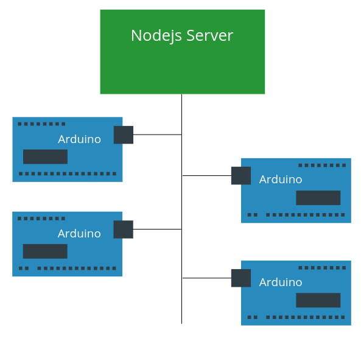

# Domotic Backend (Nodejs)

## Get Started

Follow the steps :

 1 - clone this repository in your computer by opening terminal
`git clone https://github.com/Mohamed-El-Amine-D/Domotic-Backend.git`

`cd Domotic-Backend`

 2 - Install Dependencies
`npm install`

 3 - Run the application
 `node bin/www`

## Usage

## Architecture

### Nodejs Server - Arduinos slaves

#### Communication between Nodejs & Arduino

### Arduino - Gadgets

#### Communication between Arduino $ Gadgets

## Documentation

## Contribution
If you liked this project and you want to contribute on it, checkout the Follwing links :

 * [Contibution guide](http://example.com/ "Contrbution Guide")
 * [Project Convention](http://example.com/ "Project Convention")
 * [Documentation](http://example.com/ "Documentation")
 
## Issue Reporting
If you want to report a bug or a feature request, you can report them in issue section, 
Please in case of a security vulnerabilities do not report them in public, follow Security issues Precedure.

## Authors
 - Mohamed El Amine DADDOU
 - Ben Taimia HADDADI

## Licence

Nkhamou w nchoufou